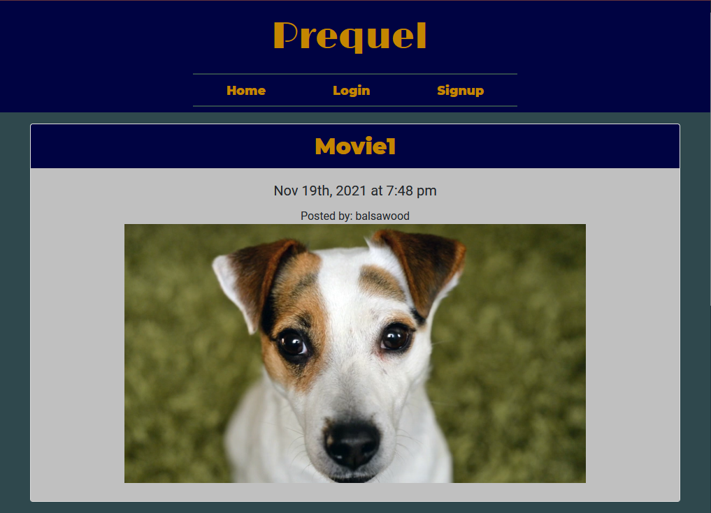
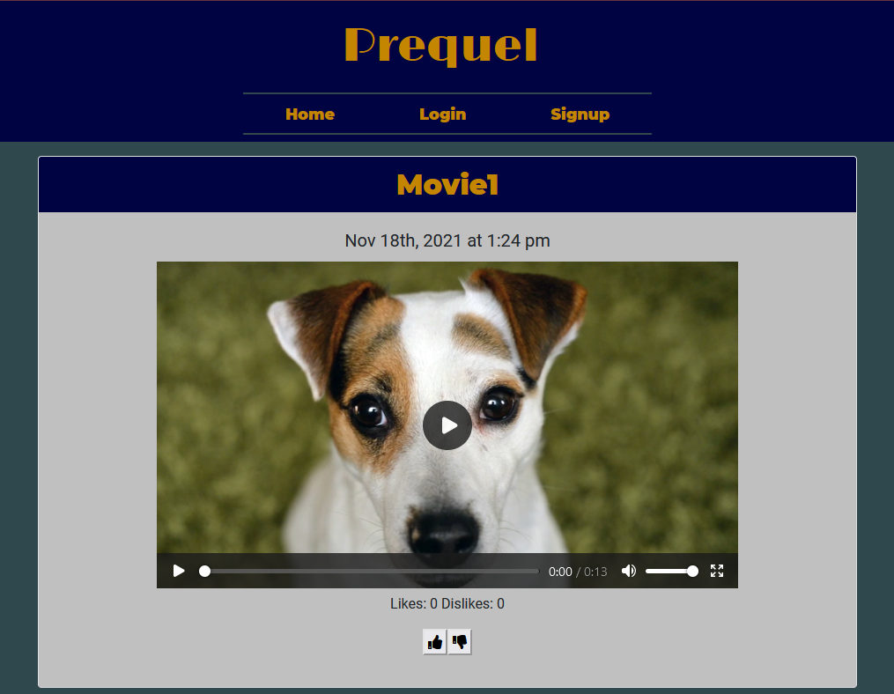

# Prequel-Streaming

## Table of Contents

-- [Description](#description)

-- [Usage](#usage)

-- [License](#license)

-- [Questions](#questions)

## Description

This application is designed to be a video upload and streaming service specifically for independent film/TV show creators to upload their work and for industry professionals to find new projects to fund. Unaffiliated viewers can view and provide likes/dislikes to videos posted, providing industry professionals with a barometer of public interest in a work as well. The overall goal of the project is to get more industry eyes on up-and-coming independent creators.

It was created using a MERN-stack setup:

- React as the front-end view
  - React-Bootstrap for styling
- GraphQL with Node.js and Express.js servers
- MongoDB and Mongoose ODM for database storage
- Heroku for deployment
- JWT (JSON WebTokens) for user authentication

Here are screenshots of the app's primary pages:

The Main Page:

The Individual Video Page:

Here is a link to the Heroku deployment: [Prequel Heroku Deployment](https://thawing-castle-85641.herokuapp.com)

## Usage

Navigate to the Heroku link provided above to get to the deployed app. Once there, an account can be created, videos can be uploaded, and all videos on the site can be seen on the main page with the most recently uploaded video being at the top of the list. The profile page will display all of the videos that the logged-in user, personally, has uploaded. A user can also delete any video they have uploaded from the database at their leisure. Individual videos can be liked or disliked by a user, with a counter incrementing on the video screen.

When visiting the site, you can create your own account or use a dummy account provided here that has a few uploaded videos already, just to demo the functionality of the site:

- Email:
- Password:

## License

This project is protected under the [MIT](https://choosealicense.com/licenses/mit/) license. (2021) (Aidan Rich, Nicole Pingar, Joey Fisher, and Phil Bohn)

## Questions

If there any questions regarding this project, our group, consisting of Aidan Rich, Nicole Pingar, Joey Fisher, and Phil Bohn can be contacted in the following places:

Our GitHub profiles and email addresses are as follows:

- [Aidan Rich](https://github.com/aidanrich) --- rich.aidan@gmail.com
- [Nicole Pingar](https://github.com/nicolepingar) --- nicolepingar@gmail.com
- [Joey Fisher](https://github.com/jfisher37) --- joseph.eric.fisher@gmail.com
- [Phil Bohn](https://github.com/lamperouge1218) --- philbohn1791@gmail.com
